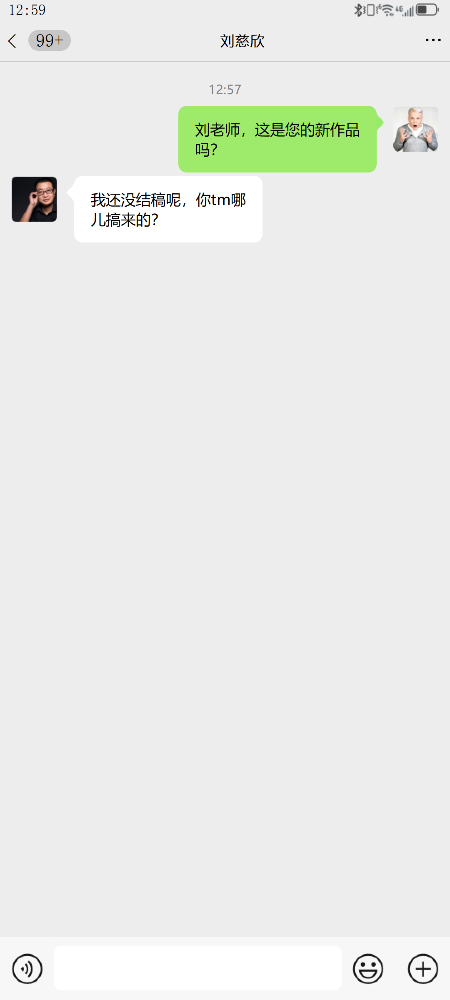
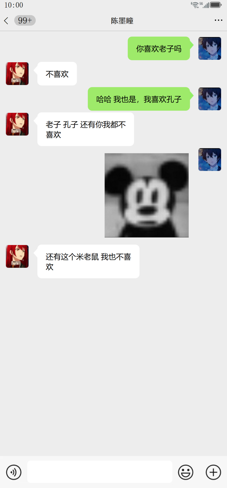

# ChatMaker | 25春PKU程序设计组队大作业

快速生成高度自定义的微信聊天截图，满足娱乐创作等场景需求。

<div>
    <a href=""><strong>▶️ 演示视频</strong></a>
</div>

## 🚀 项目概述
微信聊天记录的趣味截图（梗图）在社交网络中广泛传播，但手动制作既低效又依赖设计技巧。

**ChatMaker** 是一款基于 **Python + PyQt5** 开发的开源工具，支持：

**✔ 自定义编辑：** 对话内容、头像、昵称、时间、气泡样式等

**✔ 一键导出：** 生成逼真的微信聊天截图

📌 注意：本工具仅供合法用途，禁止用于传播误导性信息或其他非法用途。

## 🖼 效果预览
<div align="center">
  
  
</div>

## 🛠 快速开始
### 环境准备
```bash
git clone https://github.com/your-repo/ChatMaker.git
cd ChatMaker
pip install PyQt5  # 安装PyQt5等依赖
```
运行程序
```
python main.py
```
## 📂 项目结构
```text
CHATMAKER/
│
├── ui/                  # UI组件目录
│   ├── area/            # 比较复杂的组件，通常组件间有信号沟通
│   │   ├── chat.py      # 聊天区域组件
│   │   ├── emoji.py     # 表情区组件
│   │   ├── scroll.py    # 微信信息展示区组件
│   │   ├── input.py     # 输入区组件
│   │   └── function.py  # 功能区组件
│   │   
│   ├── widgets/                    # 通用小组件，通常比较简单
│   │   ├── avatar_selector.py      # 头像更改
│   │   ├── avatar.py               # 头像
│   │   ├── bubble.py               # 气泡
│   │   ├── expand_button.py        # 带拓展框的按钮
│   │   ├── insert_button.py        # 插入消息的功能按钮
│   │   ├── line_edit.py            # 单行气泡
│   │   ├── message.py              # 单条文字消息
│   │   ├── status.py               # 手机状态栏
│   │   ├── text_input.py           # 输入框
│   │   ├── title.py                # 聊天顶栏
│   │   └── pocket.py               # 红包转账
│   └── config.py                   # 配置管理
│
├── styles/              # 样式目录，对应各个组件的样式
│   ├── chat.qss         
│   ├── scroll.qss       
│   ├── input.qss     
│   ├── avatar.qss     
│   ├── message.qss      
│   └── ...    
│
└── main.py              # 主程序入口
```

## 更新日志  
详细的版本更新记录请参阅 [CHANGELOG.md](CHANGELOG.md)。